# Project FLASH — V1 Project Report

**An offline pneumonia screener built as a bit-exact neural network in FPGA hardware**

Karthikeya Reddy and Yashwant Rajesh · BITS Pilani Hyderabad ·
[github.com/Karthik-Flash/ProjectFlash](https://github.com/Karthik-Flash/ProjectFlash) ·
report of 2026-10-09, tag `v1.2.1-hw`

> **Research prototype. Not a medical device.** Nothing here is cleared or
> validated for clinical use.

**How numbers are labelled.** This report uses the four labels of the project
brief ([`docs/Project_FLASH_brief.pdf`](docs/Project_FLASH_brief.pdf)), and
each number also names the repository file it comes from.

| Label | Meaning |
|---|---|
| **Measured** | Produced by a tool or board run on the current design and reproducible from the repository: board notebooks, xsim, Vivado post-route timing and utilisation reports. |
| **Synthesis estimate** | Reported by Vivado as an estimate: post-synthesis timing and utilisation, and every power figure (Vivado power numbers are estimates even after routing). |
| **Derived** | Calculated from measured quantities. Every derived number in this report is recomputed by `tools/make_report_figures.py` into [`docs/figures/derived_numbers.json`](docs/figures/derived_numbers.json). |
| **Not yet done** | Planned work; no number exists. |

---

## 1. Summary

FLASH takes a chest X-ray and says whether it shows signs of pneumonia. The
whole convolutional neural network runs inside a low-cost AMD Zynq-7020 chip
on a PYNQ-Z2 board, with no network connection and no GPU. Its central
property is that the chip computes exactly what the trained network
computes. Every 32-bit output score matches an independent integer reference
model, bit for bit.

V1 is complete. The 224×224 network now runs on the board and reproduces the
reference model on **all 244 verification images**, for logit0, logit1,
margin and decision alike. Three bitstreams were verified: V1.2.1, its LED
variant, and the original V1.2 build with one processor register corrected.
Getting there required finding a fault that the project's simulations could
not show, because they do not model the processor's memory path. That fault,
and how it was located offline from the board's own outputs, is the main
methodological result of this report (Section 10).

| What | Value | Label | Source |
|---|---|---|---|
| Board matches the golden model, V1.2.1 (`flash_hp64`), 224×224 | **244 / 244** images, all four outputs exact | Measured | `docs/board_runs/2026-10-09/results_flash_hp64.csv` |
| Board matches, LED build (`flash_hp64_led`) | **244 / 244** | Measured | `docs/board_runs/2026-10-09/demo_flash_hp64_led_executed.ipynb` |
| Same result with the V1.2 bitstream after one AFI register write | **244 / 244** (0 / 244 without it) | Measured | `results_flash_hp32_afiforce.csv`, `results_flash_hp32.csv` |
| Clock | **66.67 MHz** (FCLK0 66.666667 MHz read back) | Measured | `summary_flash_hp64.json` |
| Post-route timing, V1.2.1 | WNS +0.314 ns, WHS +0.030 ns, 0 of 15,451 endpoints failing | Measured | `docs/reports/impl/V1_impl_timing_v1_2_hp64.rpt` |
| Chip usage, V1.2.1 | 7.26% LUT, 4.48% FF, 58.57% block RAM, 6.36% DSP | Measured | `docs/reports/impl/V1_impl_util_v1_2_hp64.rpt` |
| Time per image, compute | **182.94 ms** (12,196,126 cycles) | Measured | CYCLES register |
| Time per image, end to end | **184.73 ms**, 5.41 images/s | Measured | `summary_flash_hp64.json` |
| Same golden model on the board's ARM core | 665–744 ms per image (FPGA 3.6–4.1× faster) | Measured / Derived | `summary_*.json` |
| Model quality, V1.2, 4,003 unseen patients | AUROC **0.8229** (95% CI 0.8083–0.8379) | Measured | `v1/mem/v1_2/flash_v1_2/manifest.json` |
| Sensitivity / specificity at the chosen threshold, test set | 91.0% / 53.9% | Measured | `manifest.json` |
| Same on the 244 images, computed by the board | 0.959 / 0.467 | Measured | `results_flash_hp64.csv` |
| Chip power | 1.494 W total (1.256 W in the ARM side) | Synthesis estimate | `docs/reports/impl/V1_impl_power_v1_2_hp64.rpt` |
| Board power measurement, full 4,003-image board run, DICOM end to end on the board | — | Not yet done | — |

---

## 2. The problem

Pneumonia fills the small air sacs of the lungs with fluid. It is treatable,
yet the WHO reports that it killed 740,180 children under five in 2019, with
deaths highest in southern Asia and sub-Saharan Africa. A chest X-ray is the usual way
to confirm it, but someone has to read the X-ray. India has roughly one
radiologist per 100,000 people, concentrated in cities, so a film taken at a
small hospital can wait hours or days for a report. Both figures are as cited,
with their sources, in the brief
([`docs/archive/Project_FLASH_brief_longform_2026-09-29.md`](docs/archive/Project_FLASH_brief_longform_2026-09-29.md),
§2).

Most AI tools that read X-rays run on a server or in the cloud. That needs a
reliable connection and sends patient images off site. FLASH aims at a small
device that reads the film where it is taken and gives an immediate first
opinion, "likely normal" or "send for an urgent read". It is meant to help a
clinician prioritise, not to replace a radiologist.

We chose an FPGA rather than a phone or a small computer for one main reason:
the chip computes exactly what we validated, every time, with no operating
system or floating-point library in the way. That property is easy to test
and easy to explain to a regulator. Low power is the second reason, and it
has not yet been measured (Section 12).

---

## 3. Background in brief

**Images.** A chest X-ray is a grid of brightness values. Hospital scanners
store it as a DICOM file with 10–16 bits per pixel. FLASH's preprocessing
(`flash_preprocess.py`) applies the DICOM modality look-up table and the
window, inverts MONOCHROME1 images, letterboxes to a square, area-resizes to
224×224, and rounds to 8 bits. The network therefore sees 50,176 numbers
between 0 and 255.

**Convolution.** A convolutional neural network slides 3×3 grids of weights
over the image, multiplying and adding at every position. One multiply plus
one add is a multiply-accumulate (MAC). FLASH's network needs 12,192,896 MACs
per image (Derived, from `layer_table.json`).

**Integers.** FLASH is trained directly in integer units. The weights are
8-bit signed, activations 8-bit unsigned, biases 32-bit. After each layer the
sum is divided by a power of two (a bit shift) and clamped to 0..255, and the
clamp doubles as the ReLU activation. The numbers the chip stores *are* the
trained weights: no conversion step can go wrong.

**The two scores.** The last layer outputs two logits, for "normal" and
"pneumonia". The decision uses their difference, the *margin*. An image is
flagged when the margin exceeds a threshold T, which is stored in a register
and can be changed without retraining.

**The chip.** The Zynq-7020 has two halves. The *PS* (processing system) is a
pair of ARM Cortex-A9 cores running Linux, plus the DDR memory controller.
The *PL* (programmable logic) is the FPGA fabric that holds the accelerator.
They talk over AXI: AXI-Lite for registers, AXI-Stream for data flows, and an
AXI DMA engine that copies a buffer from DDR into a stream without the ARM
touching each byte. The fabric holds 53,200 LUTs, 106,400 flip-flops, 140
block-RAM tiles of 36 Kb and 220 DSP multipliers
(`docs/reports/synth/V1_synth_util_v1_2.rpt`).

**Correctness vocabulary.** The *golden model* is an independent NumPy
program, written in int64, that computes exactly what the hardware should.
*Bit-exact* means two computations produce identical integers. **AUROC** is
the chance that a random sick patient scores above a random healthy one: 0.5
is a coin toss, 1.0 is perfect, and it does not depend on T. **Sensitivity**
is the share of sick patients that are flagged. **Specificity** is the share
of healthy patients that are cleared.

---

## 4. How the project got here

The design went through three phases: five hackathon versions that made it
work, an audit that made it correct, and the V1 stages that made it general
and then put it on the board. Following the brief, the hackathon versions are
written H-V0…H-V4, to keep them apart from the later "v0" and "V1".

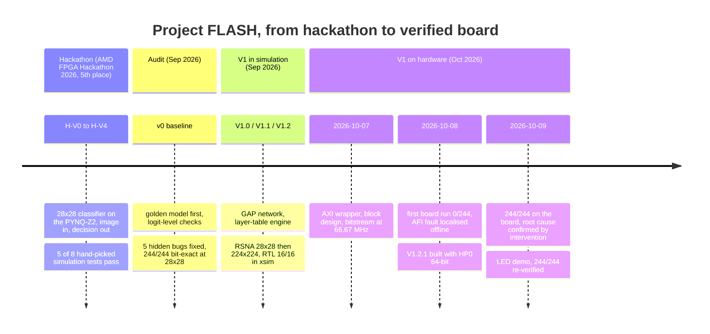

**The hackathon (H-V0 to H-V4).** Source: the archived long-form brief, §4.
H-V0 kept feature maps in a 62,720-flip-flop register array that could not be
placed; it was moved to block RAM. H-V1 widened buses after silent integer
overflow. H-V2 clock-gated the MAC pipeline, and Vivado's vector-less power
estimate fell from 35.9 W to 7.2 W. Both of those are estimates assuming
near-100% switching, not measurements. H-V3 passed 5 of 8 hand-picked
simulation tests, and the failures were blamed on the model. H-V4 ran end to
end on the board. The team placed 5th.

**The audit and v0.** After the hackathon a golden model was written first,
and every intermediate tensor from the simulator was compared with it. Five
hidden defects appeared (Section 7). With them fixed, the 28×28 design
matches the golden model on 244 of 244 images and every intermediate layer
(Measured; `v0_baseline/README.md`). It meets 75 MHz after placement with
about 83.7 MHz possible (Measured), and a SAIF-based power analysis gives
0.116 W (Synthesis estimate). The honest model accuracy is 84.7% balanced
accuracy on PneumoniaMNIST. That is lower than the hackathon's 95.4%, which
the buggy hardware could never have produced.

**Why V1.** In v0, 99% of the weights sat in one dense layer whose size was
tied to the 28×28 image. Every layer was a separate hand-written module. The
decision had no adjustable threshold. PneumoniaMNIST is tiny and pre-shrunk.
V1 replaced all four: a global-average-pooling network that runs at any
resolution, one convolution engine driven by a layer table, a threshold
register, and real hospital-format images (RSNA) at 224×224. V1.0 tested the
new architecture on PneumoniaMNIST, V1.1 on RSNA at 28×28, and V1.2 on RSNA
at 224×224.

**On hardware.** On 2026-10-07 the AXI wrapper, block design and bitstream
were built. The first board run, on 2026-10-08, gave 0/244. The fault was
located offline the same day and fixed in the block design (V1.2.1). On
2026-10-09 the fix gave 244/244, and the root cause was confirmed by
intervention. An LED variant for live demonstrations was then built and
re-verified on the same 244 images. The commit-by-commit history is in
[`docs/V1_CHANGELOG.md`](docs/V1_CHANGELOG.md).

---

## 5. Data, model and integer rules

**Data.** V1 trains on the RSNA Pneumonia Detection dataset: 26,684 adult
patients, one frontal X-ray each, radiologist-labelled, stored as DICOM. It
is split by patient into 18,678 for training, 4,003 for validation and 4,003
for testing. The test prevalence is 22.5% (`manifest.json`). The
preprocessing passed all seven of its self-tests, including on genuine
scanner files (JPEG 2000, MONOCHROME1, modality LUT before window; manifest
`preprocessing self-test`). The board runs the same preprocessing function,
so the hardware sees exactly the pixels training saw.

**Network.** Five stride-2 3×3 convolutions, then global average pooling
(GAP), then a 64→2 dense layer.

| Layer | Operation | Output at 224×224 | Parameters | MACs per image |
|---|---|---|---|---|
| conv1 | 3×3, stride 2, 1→8 | 8×112×112 | 80 | 903,168 |
| conv2 | 3×3, stride 2, 8→16 | 16×56×56 | 1,168 | 3,612,672 |
| conv3 | 3×3, stride 2, 16→32 | 32×28×28 | 4,640 | 3,612,672 |
| conv4 | 3×3, stride 2, 32→48 | 48×14×14 | 13,872 | 2,709,504 |
| conv5 | 3×3, stride 2, 48→64 | 64×7×7 | 27,712 | 1,354,752 |
| GAP | average per channel | 64 | 0 | (3,136 additions) |
| FC | dense 64→2 | 2 logits | 130 | 128 |
| **Total** | | | **47,602** | **12,192,896** |

Parameters and MACs are Derived from `v1/mem/v1_2/flash_v1_2/layer_table.json`.
The parameter count (47,432 int8 weights + 170 int32 biases) matches the
manifest.

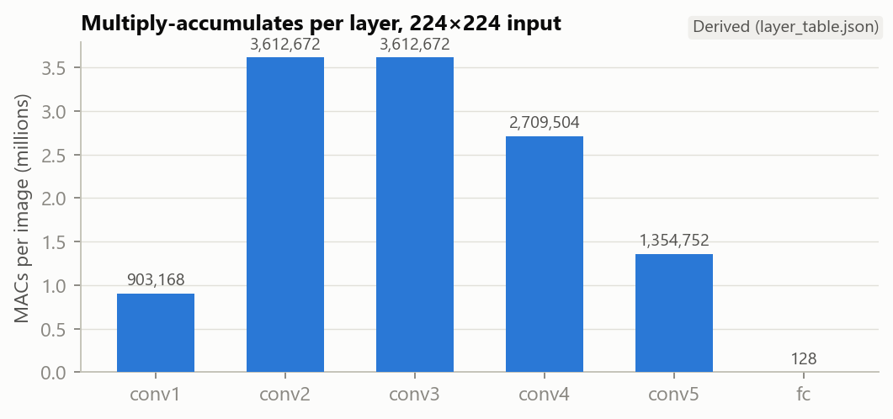

*Figure 1. Multiply-accumulates per layer at 224×224 (Derived from
`layer_table.json`). conv2 and conv3 dominate.*

Stride-2 convolutions shrink the image as they go, and they remove the
separate pooling step where one of the v0 bugs lived. GAP reduces each of
the 64 final feature maps to one number, so the classifier always sees 64
values whatever the image size. The same hardware therefore runs 28×28 and
224×224. The 47,602 parameters (about 47 KB) stay permanently on the chip.

**Integer rules.** Training, the golden model and the hardware share these
rules exactly:

- Pixels and activations are unsigned 8-bit; weights are signed 8-bit;
  biases are 32-bit.
- conv output = bias + Σ weight × pixel over the 3×3 window and every input
  channel, held in a 22-bit accumulator. The range seen on 8,006 validation
  and test images fits with margin (manifest `acc_stats`).
- The sum is shifted right by a per-layer amount (7, 7, 7, 8, 8) and clamped
  to 0..255.
- GAP sums each 7×7 map and shifts right by 6, i.e. divides by 64 instead of
  49. That is a wire, not a divider, and training sees the same thing.
- margin = logit1 − logit0. The image is flagged if margin > T.

**Training and threshold.** Training runs in two phases: unconstrained
weights first, then weights rounded to integers on every pass. The version
that scores best on the validation set is kept. T was chosen on the
validation set so that at least 90% of pneumonia cases are caught, then
locked before the test set was examined. For V1.2, T = −646 (manifest).

**Model results (test set, 4,003 patients; Measured; `manifest.json`,
`docs/audits/V1_audit_v1_2.md`).**

| | V1.1 (28×28) | V1.2 (224×224) |
|---|---|---|
| AUROC (95% CI) | 0.8143 (0.7988–0.8299) | **0.8229 (0.8083–0.8379)** |
| Sensitivity / specificity at T | 89.1% / 54.7% | 91.0% / 53.9% |
| PPV / NPV at T | 36.4% / 94.5% | 36.5% / 95.4% |
| AUROC, pneumonia vs clearly normal | 0.9328 | 0.9363 |
| AUROC, pneumonia vs other lung findings | 0.7257 | 0.7382 |
| AUROC from the view position (AP/PA) alone | 0.7064 | 0.7064 |
| AUROC within AP / within PA films | 0.7346 / 0.7472 | 0.7429 / 0.7661 |

Larger images help a little, but the confidence intervals overlap. A "clear"
result can be trusted (NPV 95.4%). A "flag" means "get this checked". The
network separates pneumonia from clearly normal lungs well, and other lung
findings much less well. Part of the score comes from a shortcut: knowing
only whether the film is AP (bedside, sicker patients) or PA scores 0.706.

---

## 6. Hardware architecture

### 6.1 The PS/PL split

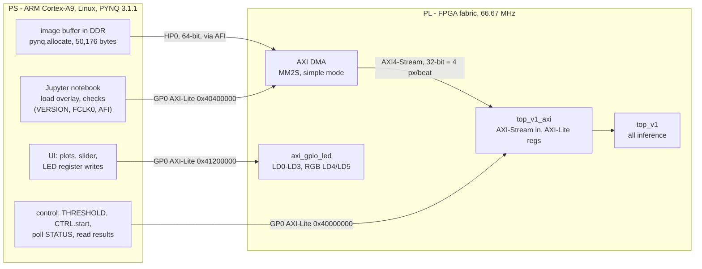

*Figure 2. What runs where. The PS handles I/O, buffers, control, the user
interface and LED writes. The PL does all of the inference, plus the DMA and
the GPIO.*

The ARM never computes any part of the network. It copies the image into a
DMA buffer, writes the threshold and a start bit, starts the DMA, polls a
status register (there is no interrupt controller in the design), and reads
back two logits, the margin, the decision and a cycle count.

### 6.2 The accelerator (`v1/rtl/`)

| Module | What it does |
|---|---|
| `layer_seq` | Reads the layer table one entry at a time, starts the right unit, swaps the two feature-map buffers between layers, and streams the GAP input. |
| `conv_engine` | The shared 3×3 stride-2 convolution: one MAC per clock, pipelined (operand mux → register → multiply → register → accumulate), 22-bit sum, then shift and clamp. Padding is gated reads: an out-of-image tap contributes zero. |
| `fmap_ram` ×2 | Buffers A and B, 128 KB each. Each layer reads one and writes the other ("ping-pong"). |
| `gap_unit` | 64 running sums over the last feature map, then the shift. |
| `fc_unit` | The 64→2 dense layer; two 32-bit logits. |
| `decision` | margin = logit1 − logit0; positive if margin > threshold. |
| `top_v1` | Connects everything, holds the weight, bias and layer-table ROMs, and lines up the memory read latencies. |
| `top_v1_axi` | The AXI wrapper (V1 hardware addition, below). |
| `line_buffer_v1` | A streaming window generator, built and tested but not instantiated; ready for a faster engine later. |

**The layer table.** Each layer is one 128-bit word: its type, kernel,
stride, padding, channel counts, input and output sizes, shift amount, and
where its weights and biases start. To change the network, regenerate this
table and the weight file; the Verilog stays the same. That is how one
circuit runs both 28×28 and 224×224.

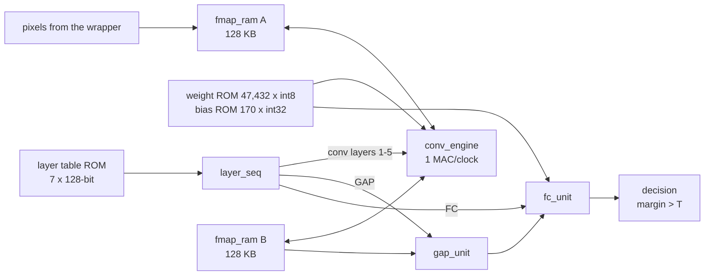

*Figure 3. Inside `top_v1`. The input image lands in buffer A; conv1 reads A
and writes B, conv2 reads B and writes A, and so on. GAP reads conv5's output
from B.*

### 6.3 The AXI wrapper and register map

`top_v1_axi` accepts the image as **32-bit AXI-Stream beats, four pixels per
beat** (byte 0 first), 12,544 beats per image. It unpacks each beat and feeds
`top_v1` one pixel per clock. The brief described the interface as one byte
per clock. That is still how the core consumes pixels, but the bus carries
four per beat. The wrapper reproduces the exact drive sequence of the
simulation testbench: the threshold write, all 50,176 pixels, one idle
cycle, then **one** start pulse. `tready` is high only while the core is
accepting pixels. A `tlast` on the wrong beat sets an error bit.

| Offset | Register | Access | Meaning |
|---|---|---|---|
| 0x00 | CTRL | W | bit 0 start (arms a run), bit 1 soft reset |
| 0x04 | STATUS | R | bit 0 busy, bit 1 done, bit 2 ready_for_pixels, bit 3 err |
| 0x08 | THRESHOLD | RW | signed 32-bit T, reset −646 |
| 0x0C / 0x10 | LOGIT0 / LOGIT1 | R | signed 32-bit logits |
| 0x14 | MARGIN | R | signed 32-bit margin |
| 0x18 | DECISION | R | bit 0 = flagged |
| 0x1C | VERSION | R | 0xF1A50102 |
| 0x20 | CYCLES | R | core clocks from start to result |

### 6.4 Block design and address map

The block design (`v1/scripts/create_bd.tcl`) contains:
- the PS7 with the PYNQ-Z2 board preset;
- an AXI DMA in simple mode, read channel only, 26-bit length;
- `top_v1_axi` as a module reference;
- a processor reset block;
- the interrupts concatenated to `IRQ_F2P`;
- in the LED build, `axi_gpio_led`.

The DMA's memory side and HP0 are 64-bit (V1.2.1; Section 10). Vivado refuses
to connect the AXI4 DMA directly to the AXI3 HP0 port, so an `auto_pc`
protocol converter sits between them.

| Block | Base address | Range |
|---|---|---|
| `top_v1_axi_0` | 0x4000_0000 | 4 KB |
| `axi_dma_0` | 0x4040_0000 | 64 KB |
| `axi_gpio_led` (LED build only) | 0x4120_0000 | 64 KB |
| DMA → HP0 → DDR | 0x0000_0000 | 512 MB |

The LED GPIO has two channels. Channel 1 drives LD0–LD3 (pins R14, P14, N16,
M14) and channel 2 drives the two RGB LEDs (6 bits: bits 0/1/2 = LD4
blue/green/red, bits 3/4/5 = LD5). Both pin sets come from the PYNQ-Z2 board
files through Vivado's board automation; no pin was typed by hand.

---

## 7. Verification method

FLASH's claim rests on a chain of three proof links, plus the board:

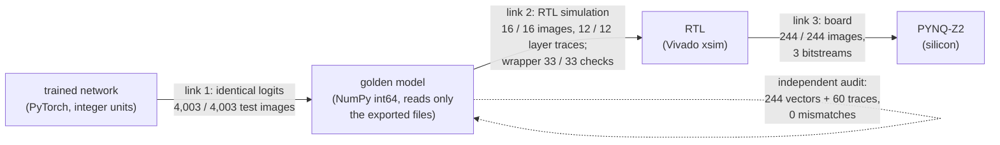

*Figure 4. The proof chain. Each arrow is a bit-exact comparison of
integers, not a tolerance.*

1. **Trained network = golden model.** Training is done in integer units,
   so the exported weights *are* the model. The golden model reads only the
   exported files and gives identical logits on all 4,003 test images, with
   0 mismatches on the intermediates of the 244 verification images
   (Measured; manifest).
2. **Golden model = RTL.** The simulator dumps every layer's output, and
   Python compares it with the golden model, so a mismatch points to the
   exact layer. At 224×224: 16 of 16 images exact, and 12 of 12 per-layer
   trace files (Measured; `tb_v1`). The AXI wrapper passed a 33-check
   testbench with three images, varied bus timing and error cases (Measured;
   `tb_v1_axi`, `docs/BRINGUP_STATUS.md`). An independent audit re-ran the
   golden model against all 244 vectors and 60 trace files of both stages:
   0 mismatches (`docs/audits/`).
3. **RTL = board.** The board compares all four outputs on all 244 images
   with the expected files (Measured; Section 9).

**The verification set.** The 244 images are a seeded (`SEED = 0`), balanced
slice of the test split: 122 pneumonia, 122 not. They were chosen without
looking at the model's confidence, and the model gets 70 of them wrong at
T = −646 (Derived). The hardware must reproduce the mistakes too, because a
matching 32-bit score cannot happen by accident. The hackathon's test checked
one yes/no bit on eight images picked because the model was confident about
them. That is why three datapath bugs survived five versions.

**Bug ledger, all phases.**

| # | Phase | Defect | How it was found | Effect | Fix |
|---|---|---|---|---|---|
| 1 | Hackathon → v0 | Line buffer read one window pixel before it was written | Golden-model tensor diff | Every 3×3 window had one wrong pixel | Valid-window generator over a zero-padded frame |
| 2 | Hackathon → v0 | Line-buffer windows centred one row early | Same | Last row never used; whole map shifted | Same rewrite |
| 3 | Hackathon → v0 | Max-pool captured BRAM data one clock early | Same | Pool compared the wrong values | Explicit 8-state sequencer |
| 4 | Hackathon → v0 | Dense-layer read pointer off by one | Same | One input skipped, another used twice | Explicit read invariant |
| 5 | Hackathon → v0 | Testbench drove inputs on the sampling edge and read results one clock early | Same | Tests read the previous image's answer | Drive on negedge, sample after settle |
| 6 | V1 RTL | `gap_unit` testbench raced the DUT with blocking assignments | Reproduction in isolation | Samples bound to the wrong channel | Non-blocking drives (`6018958`) |
| 7 | V1 RTL | conv and FC units assume 2-cycle reads; `fmap_ram` is 1-cycle | Integration sweep | Arithmetic read the neighbouring pixel | One register stage on the read path (`f964249`) |
| 8 | V1 RTL | `layer_seq` needed two start pulses to relaunch | Integration sweep | Previous image's result left standing | Single-pulse relaunch (`f964249`) |
| 9 | V1.2 RTL | 64 KB feature-map RAM too small for 224×224 conv1 (100,352 bytes) | First 224×224 simulation | Writes dropped, X reads | 128 KB RAM (`57126bc`) |
| 10 | V1.2 testbench | 200 ms timeout too short for 224×224; an unsized 5 s literal would wrap at 32 bits, and xsim rejected the sized one | Simulation | Sweep cut off | Cycle-counted timeout (`1adcb86`, `142f11c`, `e192198`) |
| 11 | V1.2 synthesis | Synthesis loaded the **v1_1** weights through `top_v1.v`'s defaults | Log audit (`Synth 8-3876` lines) | A bitstream would have computed the wrong model with no error | v1_2 defaults and absolute paths (`d1dc26f`) |
| 12 | Documentation | Narrative overclaimed: RTL "244" (was 16), "whole test split" (a subset), V1.2 "reused V1.1 weights" (it did not) | Review | Claims ahead of evidence | Corrected with a revision note |
| 13 | Export | Manifest hashes cover only 3 of 313 `.mem` files per stage | Audit (`227186b`) | Vectors have no recorded checksum | Not yet fixed in the notebook (Section 12) |
| 14 | Wrapper testbench | `send_stream` took a beat twice | Timeout in the first xsim run | False failure; the wrapper was correct | TB fixed (`d2ecb7e`) |
| 15 | Board | HP0 AFI in 64-bit mode, PL port 32-bit | Board 0/244, then offline model search | Every odd 32-bit input word replaced | HP0 and DMA at 64 bits (V1.2.1); Section 10 |

Defects 1–5 are the "five hidden bugs" of the brief. Defects 11 and 15 are
the ones that would have produced a confidently wrong device, with no error
message.

---

## 8. Implementation results

| | V1.2 (HP0 32-bit) | **V1.2.1 `flash_hp64`** | **V1.2.1-led `flash_hp64_led`** |
|---|---|---|---|
| FCLK0 | 66.666672 MHz | 66.666672 MHz | 66.666672 MHz |
| WNS / WHS | +0.206 / +0.024 ns | **+0.314 / +0.030 ns** | **+0.344 / +0.025 ns** |
| Failing endpoints | 0 of 15,320 | 0 of 15,451 | 0 of 15,704 |
| LUT | 3,818 (7.18%) | 3,864 (7.26%) | 3,947 (7.42%) |
| Flip-flops | 4,745 (4.46%) | 4,766 (4.48%) | 4,899 (4.60%) |
| Block RAM (RAMB36 + RAMB18 → tiles) | 81 + 1 → 81.5 (58.21%) | 81 + 2 → 82 (58.57%) | 81 + 2 → 82 (58.57%) |
| DSP | 14 (6.36%) | 14 (6.36%) | 14 (6.36%) |
| Power, total (PS7) | 1.492 W (1.256 W) | 1.494 W (1.256 W) | 1.499 W (1.256 W) |
| `.bit` SHA-256 | `396a219b10690f26` | `0ee58d6c924cd162` | `7e0c3394fac1b57d` |

Timing and utilisation are Measured (post-route reports in
`docs/reports/impl/`). Power is a Synthesis estimate: vector-less, with
confidence Medium for the first two builds and Low for the LED build.
Percentages are Derived against the device totals.

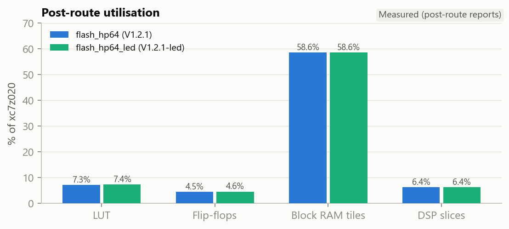

*Figure 5. Post-route utilisation of the two V1.2.1 builds (Measured). Block
RAM, mostly the two 128 KB feature-map buffers, is the only substantial
resource.*

Of `flash_hp64`'s 3,864 LUTs, the accelerator uses 2,758; the DMA uses 528,
the GP0 interconnect 518, and the HP0 protocol converter 44. The LED GPIO
adds 64 LUTs and 132 flip-flops. The accelerator's netlist is the same in all
three builds: its 2,274 `INIT_xx` lines (weights, biases, layer table) are
identical (`docs/V1_board_debug_log.md`).

**Why 66.67 MHz, not 75 MHz.** The brief's 75 MHz was a synthesis estimate for
the accelerator alone (WNS +0.085 ns; Synthesis estimate). On the chip:
- The PS cannot generate 75 MHz for the fabric. Requesting it gives 76.92 MHz.
- The next achievable frequency, 71.43 MHz, failed post-route timing by
  0.925 ns (Measured; `docs/BRINGUP_STATUS.md`).
- The critical path is the convolution engine's feature-map address
  arithmetic, a DSP multiply-add into the block-RAM address pins. In
  `flash_hp64` this path takes 13.786 ns of the 15 ns budget, 70% of it logic
  (Measured).
- 66.67 MHz (1000 MHz / 15) meets timing.

The RTL was frozen for the board work, so the lower clock was accepted.
Pipelining the address path is the first V2 hardware item.

---

## 9. Board results

### 9.1 Bit-exactness

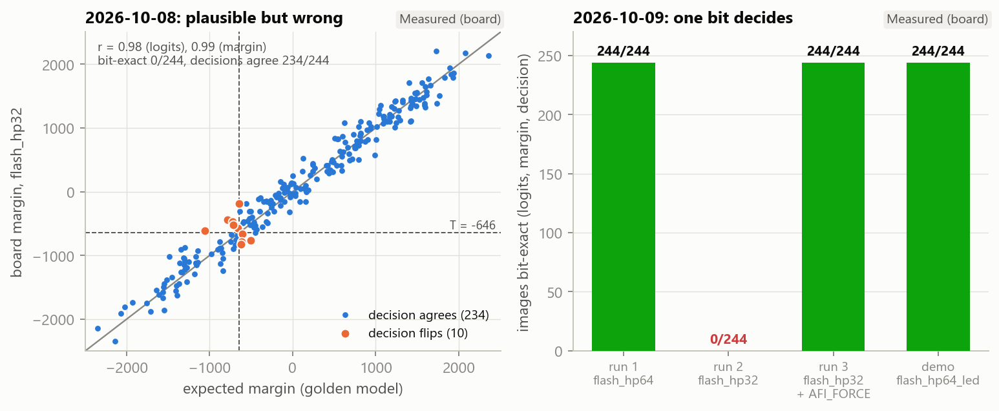

*Figure 6. Left: the failing run of 2026-10-08. The board's margins against
the expected ones correlate at r = 0.98 for the logits, and 234 of 244
decisions agree, yet no image is bit-exact (Measured). Right: the runs of
2026-10-09 (Measured).*

| Run (2026-10-09) | Bitstream | AFI RDCHAN_CTRL bit 0 | Bit-exact (logit0 / logit1 / margin / decision) | TP / FN / TN / FP |
|---|---|---|---|---|
| 1 | `flash_hp64` | 0, as booted | **244/244** (244 / 244 / 244 / 244) | 117 / 5 / 57 / 65 |
| 2 | `flash_hp32` | 0, as booted | **0/244** (0 / 0 / 2 / 234) | 118 / 4 / 56 / 66 |
| 3 | `flash_hp32` + `AFI_FORCE` | 0 → 1 | **244/244** | 117 / 5 / 57 / 65 |
| demo | `flash_hp64_led` | 0 | **244/244** | 117 / 5 / 57 / 65 |

All Measured (`docs/board_runs/2026-10-09/`). On every image of every run,
CYCLES = 12,196,126 and VERSION = 0xF1A50102, and the error bit was never
set. Runs 1 and 3 wrote byte-identical CSV files. Run 2 equals the
2026-10-08 failure image by image. The threshold register works: at T =
0x7FFFFFFF image 0 keeps its margin and its decision becomes 0.

*Figure 7. Board output from the live demo (Measured): the first six true
positives and first six true negatives by index, each classified live by the
FPGA (all 12 bit-exact) and by the ARM golden model.*

### 9.2 Latency and throughput

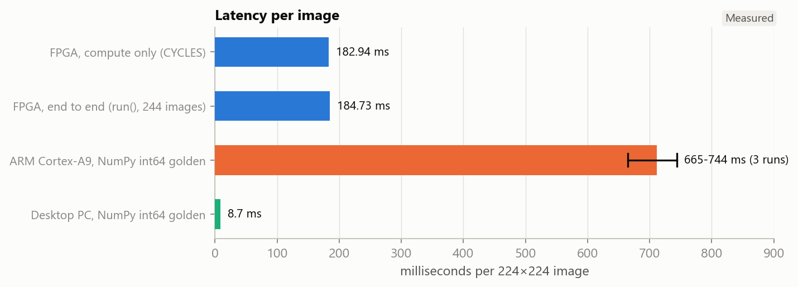

*Figure 8. Time per 224×224 image (Measured; ARM range over three runs).*

| Metric | Value | Label |
|---|---|---|
| Compute (CYCLES = 12,196,126 at 66.666667 MHz) | **182.94 ms**, 5.47 images/s | Measured cycles; Derived ms |
| End to end, 244 back-to-back `run()` calls, images in memory | **184.73 ms**, 5.41 images/s | Measured |
| Host overhead (copy, cache flush, registers, DMA, polling) | 1.79 ms (0.97%) | Derived |
| Repeatability across runs 1–3 | 184.73 / 184.71 / 184.70 ms | Measured |
| Sweep wall time including `.mem` text parsing | 153.8 s (630 ms/image) | Measured |
| The brief's 163 ms | 162.62 ms at 75 MHz with the measured cycle count | Derived |

CYCLES exceeds the network's MAC count by 3,230. Of those, 3,136 are the GAP
stream (64 channels × 49 values, one per clock), and about 94 are sequencing
and pipeline drain (Derived). The engine does one MAC per clock by design.

### 9.3 ARM baseline, honestly

The board's own ARM core ran the same golden model on image 0 once per
session: 743.9, 726.3 and 665.1 ms (Measured). In the demo it ran 12 images
at a mean of 706.6 ms against the FPGA's 185.0 ms, a speedup of 3.8×
(Measured). Every ARM result equalled the expected integers. Across sessions
the FPGA's compute is **3.6–4.1× faster** (Derived).

This baseline is weak, and the report says so. It is unoptimised NumPy int64
on one Cortex-A9 core. A NEON int8 implementation, or both cores, would be
faster. On the development PC (Intel Core i7-13650HX) the same code takes
**8.7 ms** (Measured; `docs/figures/pc_golden_timing.json`). V1's engine does
one MAC per clock on purpose. V1 shows that the integer network runs exactly
in hardware; it does not show that the FPGA is fast. A Raspberry Pi
comparison is Not yet done.

### 9.4 Classification on the 244

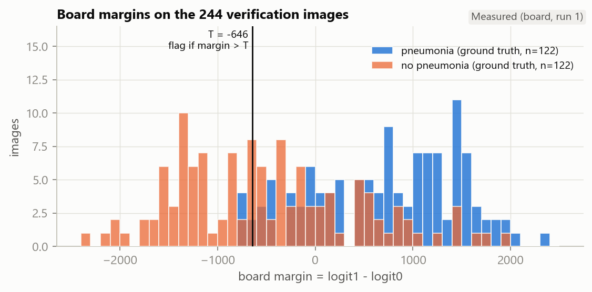

*Figure 9. Board margins on the 244 images, by ground truth (Measured). The
vertical line is T = −646.*

| | Predicted pneumonia | Predicted no pneumonia |
|---|---|---|
| **Pneumonia (122)** | TP 117 | FN 5 |
| **No pneumonia (122)** | FP 65 | TN 57 |

| Metric | Value (95% CI) | Label |
|---|---|---|
| Sensitivity | 0.959 (Wilson 0.908–0.982) | Measured counts; Derived CI |
| Specificity | 0.467 (Wilson 0.381–0.555) | Same |
| PPV / NPV / accuracy | 0.643 / 0.919 / 0.713 (174 of 244) | Derived |
| AUROC from board margins | 0.837 (bootstrap 0.785–0.884; 2,000 resamples, seed 0) | Derived |
| **Test-set AUROC, 4,003 patients (headline)** | **0.8229 (0.8083–0.8379)** | Measured (manifest) |

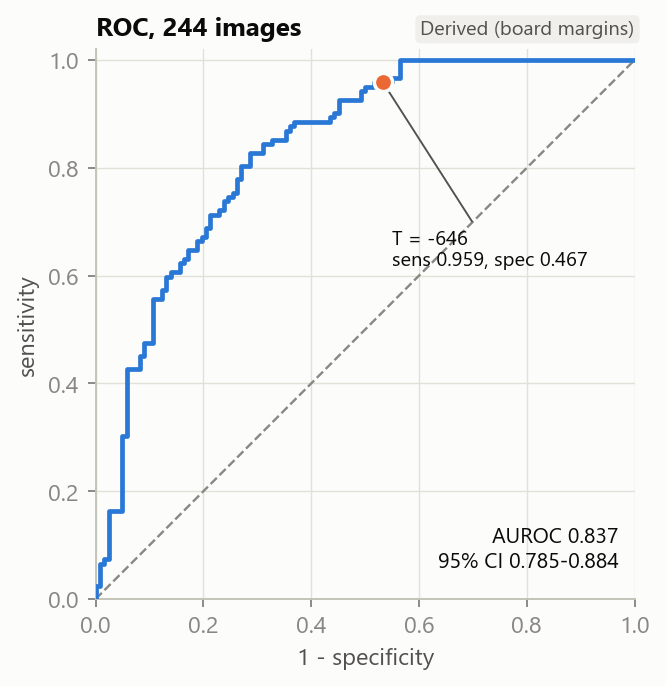

*Figure 10. ROC curve from the board margins on the 244 images, with the
operating point at T = −646 (Derived).*

What the board shows about the model:

- **The errors are mostly false positives: 65 against 5.** That was the
  design choice: T was set on validation data for ≥90% sensitivity.
- **The five false negatives are near-misses.** Their margins are −736 to
  −670, all within 90 of T.
- **The false positives spread up to +1,928.** The median negative margin is
  −595.5, so 65 of the 122 negatives lie above T.
- **The "Not Normal" label explains much of it.** RSNA's negative class mixes
  "Normal" with "No Lung Opacity / Not Normal". The manifest records this
  three-way class for every verification image. 50 of the 76 "Not Normal"
  negatives are flagged (65.8%), against 15 of the 46 "Normal" ones (32.6%)
  (Derived). On the full test set, pneumonia vs Normal scores AUROC 0.9363
  and pneumonia vs Not Normal 0.7382.
- **The 244 AUROC (0.837) is consistent with the test-set figure.** No
  overfitting is visible here. The repository's notebook has no saved
  training curves, so nothing more is claimed.

The threshold trade-off below is computed on these test images. It is
illustrative only and must not be used to pick T (Derived):

| T | −646 | −400 | −200 | 0 | +200 |
|---|---|---|---|---|---|
| Sensitivity | 0.959 | 0.885 | 0.852 | 0.779 | 0.713 |
| Specificity | 0.467 | 0.566 | 0.656 | 0.738 | 0.787 |

---

## 10. Case study: a bug only the board could show

**The symptom.** On 2026-10-08 the first V1.2 bitstream returned 0/244
bit-exact (Measured). Nothing else looked wrong:
- the logits correlated with the expected ones at 0.98;
- 234 of 244 decisions agreed;
- the result was the same at 25, 50 and 66.67 MHz, which ruled out timing;
- repeated runs, soft resets and different image orders gave identical
  outputs;
- the DMA reported no errors.

A test that compared decisions would have passed this hardware. **Only the
logit-level bit-exact comparison caught it.**

**Localising it offline.** Instead of guessing at the RTL, we treated the
golden model as an instrument and fed the board synthetic probes (Measured;
`docs/board_runs/2026-10-08/diag_1.json`):
- Constant images and a ramp that is constant along each row came back
  **exact**.
- A ramp along each row came back wrong.

That pointed at the order of pixels within a row. A search over candidate
corruptions found exactly one model that reproduces every board output: each
odd 32-bit word of the input (four pixels) is replaced by the even word before
it. Candidates included byte orders within a beat, row shifts, flips, block
reversals, beat permutations and padding variants.

`board == golden(dup_even(x))` holds on **244/244 images and 24/24 probes**
(Derived; `derived_numbers.json`). A 32-bit word pair never crosses a
224-pixel row, which is why the row-constant probes were immune.

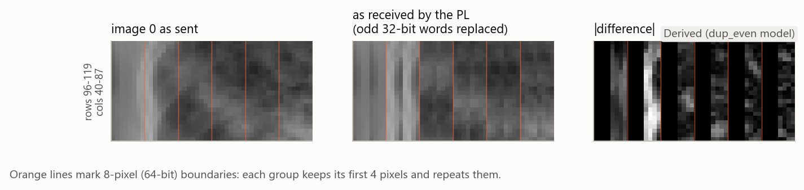

*Figure 11. A crop of image 0 as sent and as the PL received it (Derived from
the model). The corruption works like a mild horizontal blur, which the GAP
network largely tolerates. That is why the decisions looked right.*

**Predicting before checking.** The model and the golden model disagree on
only some probes. For the second probe set, the model's predictions were
written into the debug log before the board's results were looked at
(`diag_2.json` had not yet been copied off the board). Two single-pixel
probes discriminate: px(1,0) and px(223,223). The model predicted
(−349, 102, 451) and the const-0 result, where the golden model predicts the
const-0 result and (−386, 114, 500). The board's numbers matched the model's
predictions exactly (Measured; `diag_2.json`).

**The mechanism.** The DMA reads DDR through the PS's HP0 port. HP0 has a
bridge, the AFI, with its own data-width setting: bit 0 of the RDCHAN_CTRL
register.
- The V1.2 design used a 32-bit HP0.
- PYNQ boots the PS with the AFI in 64-bit mode and does not run the
  design's own PS initialisation code.
- Each 32-bit read therefore returned the low half of a 64-bit word, which is
  the even word.

**Confirmation by intervention.** On 2026-10-09, on one boot:
- The same 32-bit bitstream gave 0/244 (run 2).
- After writing that single register bit from 0 to 1, it gave 244/244
  (run 3).

Nothing else changed. That is a causal test, not a fit.

**The fix and the safeguard.** V1.2.1 makes HP0 and the DMA's memory side
64-bit, which matches PYNQ's default; no register write is needed (run 1:
244/244). Every board notebook now compares the AFI setting with the
bitstream's `.hwh` on load. The demo notebook refuses to run on a mismatch.

**Lessons for V2:**
- Simulation drove the stream directly and never modelled the PS memory
  path, so it could not see this fault. Either model the path or keep the
  board-side check.
- Compare integers on the board, never only decisions.
- Write predictions down before looking at the discriminating test.

The full record is [`docs/V1_board_debug_log.md`](docs/V1_board_debug_log.md).

---

## 11. The live demo

The demo notebook (`v1/board/flash_v1_2_demo.ipynb`, generated by
`make_demo_notebook.py`) runs from the board's folder with `flash_hp64_led`.
The executed copy is `docs/board_runs/2026-10-09/demo_flash_hp64_led_executed.ipynb`.

- **Load and checks.** It prints the bitstream SHA-256, VERSION and FCLK0. It
  checks the AFI against the `.hwh`, and on a mismatch it stops with "reboot
  the board and re-run". It never forces the register.
- **LED self-test.** LD0–LD3 on for 1 s, then both RGB LEDs red, green and
  blue (0.5 s each), then off.
- **Gallery.** The first six true positives and first six true negatives by
  index, chosen by a fixed rule stated in the notebook, not by hand. Each is
  run live on the FPGA and on the ARM golden model (Figure 7): 12/12
  bit-exact, mean 185.0 ms vs 706.6 ms (Measured).
- **Live sweep.** All 244 images with a running counter: 244/244 bit-exact,
  sensitivity 0.959, specificity 0.467, AUROC 0.8367 from the board's margins
  (Measured; 56.5 s including file loading).
- **Slider.** Any image, live. The board signals the decision:
  - pneumonia: LD0–LD3 blink at 4 Hz for 2.5 s with the RGB LEDs red;
  - negative: the RGB LEDs green for 1.5 s.
- **Limitations, shown rather than hidden.** The notebook ends with the first
  false positive and first false negative and states the operating-point
  trade-off.

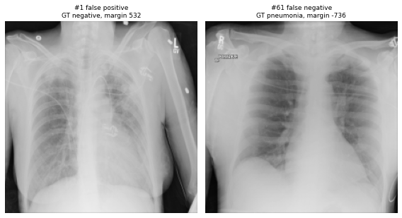

*Figure 12. The demo's limitations cell (Measured): image 1, a negative with
margin +532, is flagged; image 61, a pneumonia case with margin −736, is
missed.*

---

## 12. Limitations and what is not done

- **Not a medical device.** An AUROC of 0.82 on a research dataset is
  research grade. Clinical use would need prospective validation, comparison
  with radiologists, multiple sites and scanners, and regulatory work.
- **The model.** It has modest discrimination. Most of its false positives
  are abnormal-but-not-pneumonia studies, and part of its score comes from
  the AP/PA film type (Section 5).
- **Speed.** 66.67 MHz, not 75 MHz, and one MAC per clock, so 183 ms per
  image. A desktop CPU runs the same integer model faster.
- **Small-sample metrics.** The sensitivity and specificity measured on the
  board come from 244 images.

| Not yet done | Why it matters |
|---|---|
| Board run on all 4,003 test images | The published accuracy would then literally be the board's output. Today it is the golden model's output, which the board reproduces on 244 of 244. |
| Measured power (USB meter idle and running; SAIF-based estimate) | Low power is a stated motivation; only vector-less estimates exist. |
| Raspberry Pi–class comparison and an optimised ARM baseline | To state fairly what the FPGA adds. |
| DICOM → preprocessing → board, end to end on the board | The pixels are proven identical in software; the board has not run that path. |
| External and paediatric data | Pneumonia deaths are concentrated in children; RSNA is adults from one source. |
| 75 MHz or faster | Needs the conv address path pipelined (V2). |
| Manifest hashes for all exported files | The audit found 3 of 313 `.mem` files hashed per stage. |

---

## 13. V2 roadmap (future work, in priority order)

1. **A clinical operating point and better specificity.** This is the
   largest weakness, and the board data says where it comes from.
   - **Evidence:**
     - 65.8% of "Not Normal" negatives are flagged, against 32.6% of
       "Normal" ones;
     - test-set AUROC is 0.9363 against Normal but 0.7382 against Not Normal;
     - the AP/PA view alone scores 0.7064.
   - **Work:** treat "No Lung Opacity / Not Normal" explicitly (three-way
     training, or a separate abnormal output); report and select per view;
     choose T on validation data for a stated specificity as well as
     sensitivity.
   - **Why first:** it changes what the device is useful for, and it needs
     no hardware change, because T is a register.
2. **Parallel MACs.**
   - **Evidence:** only 14 of 220 DSP slices are used.
   - **Work:** several MACs per clock, which needs wider or parallel
     feature-map reads, because the engine currently reads one byte per
     clock. `line_buffer_v1` is built and tested for this.
   - **Why:** latency falls roughly in proportion; this is the step that
     makes the FPGA genuinely fast.
3. **Pipeline the convolution address path, for ≥75 MHz.**
   - **Evidence:** this path is the post-route critical path; at 75 MHz the
     measured cycle count would give 162.62 ms (Derived).
   - **Why:** a cheap, local change with a direct speed gain.
4. **Measured power.**
   - **Work:** an inline USB meter, idle and running, plus a SAIF-based
     estimate from post-implementation simulation.
   - **Why:** low power is half of the case for an FPGA, and today it rests
     on a vector-less estimate dominated by the PS.
5. **A board run on all 4,003 test images.**
   - **Work:** export the 4,003 test images and run them through the
     existing notebook. That is about 12 minutes of compute at 182.94 ms
     each (Derived), plus file transfer.
   - **Why:** the published accuracy would then be literally the board's
     output.
6. **DICOM end to end on the board.**
   - **Feasibility:** the manifest records the RSNA patient ID of every
     verification image, so matching DICOM files can be fetched.
     `flash_preprocess.py` needs pydicom and OpenCV, and whether PYNQ 3.1.1
     provides both offline is not yet checked.
   - **Work:** preprocess on the ARM, run on the FPGA, and assert equality
     with `exp_*` for that index.

---

## 14. Reproducibility

**Tools.** Vivado 2022.2; PYNQ 3.1.1 on the PYNQ-Z2. Training ran in Colab
with torch 2.11.0+cu128, NumPy 2.1.3, pydicom 3.0.2 and OpenCV 5.0.0
(manifest). The figures were made with Python 3.13.9 and NumPy 2.3.5.

| Step | Command (from the repository root) |
|---|---|
| Train and export | Run `colab/ProjectFlash_V1.ipynb` (`STAGE = 'V1.2'`, `SEED = 0`); unzip the export into `v1/mem/v1_2/flash_v1_2/` |
| RTL simulation, wrapper | `v1\scripts\sim_tb_v1_axi.bat` → `RESULT: PASS` |
| Synthesis of `top_v1` alone | `vivado -mode batch -source v1/scripts/synth_top_v1.tcl` |
| Block design, implementation, bitstream | `vivado -mode batch -source v1/scripts/build_hw.tcl -tclargs verilog/ProjectFlashV1_hw/ProjectFlashV1_hw.xpr 70.0 flash_hp64` (add `flash_hp64_led 1` for the LED build) |
| Notebooks | `python v1/board/make_notebook.py v1/board/flash_v1_2_board.ipynb 66.666672 top_v1_axi_0 axi_dma_0`; `python v1/board/make_demo_notebook.py v1/board/flash_v1_2_demo.ipynb` |
| Board bundle | `powershell -ExecutionPolicy Bypass -File v1\board\make_board_bundle.ps1` (263 files) |
| Board run | `v1/board/README.md`, sections 5–6 |
| Report figures and derived numbers | `python tools/time_golden_pc.py` then `python tools/make_report_figures.py` |

**Artefacts (SHA-256 prefixes).**

| File | SHA-256 |
|---|---|
| `v1/board/flash_hp64.bit` / `.hwh` | `0ee58d6c924cd162` / `7011237c69968c86` |
| `v1/board/flash_hp64_led.bit` / `.hwh` | `7e0c3394fac1b57d` / `2b37db60135ed638` |
| `v1/board/flash_hp32.bit` / `.hwh` | `396a219b10690f26` / `5f8c18af7bdf3650` |
| `v1/mem/v1_2/flash_v1_2/vectors/img_0.mem` | `b646ab2d4af88b2e` |
| `v1/mem/v1_2/flash_v1_2/vectors/exp_logit0.mem` | `0d317dcf865a5210` |

`.gitattributes` keeps the bitstreams, the `.hwh` files and all board
evidence byte for byte, so these hashes hold on any checkout. The evidence
files and their hashes are listed in each `docs/board_runs/<date>/README.md`.

**Tags.** `v1.2.1-hw` marks this report and the verified V1.2.1 hardware.
The heavy verification vectors (244 images, 60 traces) are not in git. They
are regenerated by the notebook with the same seed and are also inside the
board bundle.

---

## 15. Resuming the project

For whoever restarts this later:

1. **Read first:** this report, then
   [`docs/V1_board_results_v1_2.md`](docs/V1_board_results_v1_2.md) and
   [`docs/V1_board_debug_log.md`](docs/V1_board_debug_log.md).
   [`docs/README.md`](docs/README.md) indexes everything else.
2. **Vivado project:** `verilog/ProjectFlashV1_hw/ProjectFlashV1_hw.xpr` is
   the only one to use. It is local and gitignored, and it is rebuilt from
   the repository by `v1/scripts/build_hw.tcl`. `ProjectFlashV1` is legacy:
   bare `top_v1`, which cannot be implemented. See `verilog/README.md`.
   Vivado 2022.2.
3. **Rebuild the hardware:** close the project in the GUI, then run
   `build_hw.tcl` as in Section 14. The default FCLK ceiling (70 MHz) gives
   the verified 66.666672 MHz. Check that every `runme.log` shows
   `Synth 8-3876` for the three v1_2 `.mem` files and no `8-4445`. The scripts
   copy the `.bit`/`.hwh` into `v1/board/` and the reports into
   `docs/reports/impl/`.
4. **Run the board:** build the bundle, copy it to
   `\\192.168.2.99\xilinx\jupyter_notebooks\flash_v1_2\`, boot fresh, and run
   `flash_v1_2_board.ipynb` with `flash_hp64.bit`. Expect AFI OK and
   244/244. The demo is `flash_v1_2_demo.ipynb`. Full steps:
   `v1/board/README.md`.
5. **Where the evidence lives:** `docs/board_runs/<date>/`, with one README
   per session listing SHA-256s. Never edit those files. Add a new dated
   folder for every new session, and note the real date there, because the
   board clock is unset.
6. **Golden model:** `v1/mem/v1_2/flash_v1_2/tools/golden_model_v1.py`. The v0
   one is `v0_baseline/tools/golden_model.py`.
7. **The first three V2 tasks:**
   1. Specificity: three-way training or an abnormal output, a per-view
      analysis, and T chosen on validation for a stated specificity
      (Section 13, item 1).
   2. Pipeline the convolution address path and re-close timing at 75 MHz
      or above.
   3. Parallel MACs in `conv_engine`, using the spare DSP slices.

   Re-verify 244/244 on the board after every change, and compare logits,
   not decisions.
