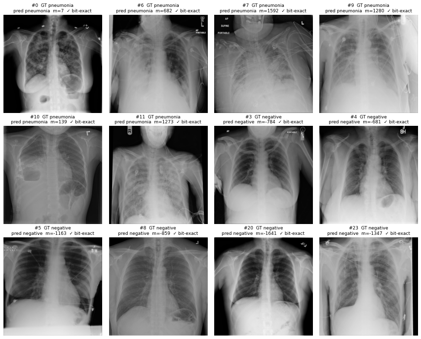

# Project FLASH

**An offline pneumonia screener built as a bit-exact neural network in FPGA hardware.**

FLASH takes a chest X-ray and says whether it shows signs of pneumonia. The
whole convolutional neural network runs as Verilog in the programmable logic
of a low-cost AMD Zynq-7020 (PYNQ-Z2 board), with no network connection and no
GPU. Its defining property is exactness: on the board, the chip reproduces an
independent integer reference model **bit for bit**.

> **Research prototype. Not a medical device.** It is not cleared or validated
> for clinical use and must not be used to diagnose, screen or treat anyone.

**Team FLASH** · BITS Pilani Hyderabad · Karthikeya Reddy (ML) · Yashwant Rajesh (Architecture) ·
5th place, AMD FPGA Hackathon 2026 (predecessor: [PneumoniaFPGA](https://github.com/Karthik-Flash/PneumoniaFPGA))

📄 **Full write-up: [`PROJECT_FLASH_REPORT.md`](PROJECT_FLASH_REPORT.md)** ·
board results: [`docs/V1_board_results_v1_2.md`](docs/V1_board_results_v1_2.md) ·
docs index: [`docs/README.md`](docs/README.md)



*Live on the PYNQ-Z2 (2026-10-09): the first six true positives and first six
true negatives by index, each classified by the FPGA (12/12 bit-exact against
the golden model) and, for comparison, by the board's ARM core.*

## Status: V1 complete (V1.2.1, tag `v1.2.1-hw`)

Labels as in the [project brief](docs/Project_FLASH_brief.pdf). **Measured**
means a tool or board run on the current design; **Synthesis estimate** means
a Vivado estimate (every power figure is one); **Derived** means computed from
measured values; **Not yet done** means no number exists.

| What | Value | Label |
|---|---|---|
| Board output = golden model, 224×224, V1.2.1 | **244 / 244 images**: logit0, logit1, margin and decision all exact | Measured |
| Same, LED demo build | **244 / 244** | Measured |
| Time per image | **182.94 ms** compute (12,196,126 cycles), **184.73 ms** end to end | Measured |
| Clock, post-route timing | **66.67 MHz**; WNS +0.314 ns, WHS +0.030 ns, 0 failing endpoints | Measured |
| Chip usage | 7.3% LUT, 4.5% FF, 58.6% block RAM, 6.4% DSP | Measured |
| FPGA vs the board's ARM (same NumPy model) | 3.6–4.1× faster (ARM 665–744 ms) | Derived |
| Model quality, 4,003 unseen test patients | AUROC **0.8229** (95% CI 0.8083–0.8379); sensitivity 91.0% / specificity 53.9% at the chosen threshold | Measured |
| On the 244 verification images, computed by the board | sensitivity 0.959, specificity 0.467, AUROC 0.837 | Measured / Derived |
| Chip power | 1.494 W, of which 1.256 W is the ARM side | Synthesis estimate |
| Measured board power; full 4,003-image board run; DICOM end to end on the board | — | Not yet done |

**Headline results.**

- **Bit-exact on silicon.** The board reproduces the golden model on all 244
  verification images, on three bitstreams.
- **A board-only fault, found offline.** The first board run gave 0/244 while
  234/244 decisions still agreed. The cause was located offline with the
  golden model and 24 probe images: the PS's HP0 port bridge was in 64-bit
  mode while the design used 32 bits. It was confirmed on the board by
  flipping that one register bit (0/244 → 244/244). See report §10.
- **One engine, any resolution.** A single 3×3 convolution engine, driven by
  a layer table in on-chip memory, runs 28×28 and 224×224 with the same
  Verilog.

## Repository map

```
PROJECT_FLASH_REPORT.md   the V1 project report (start here)
README.md                 this page
colab/                    training + export notebooks (ProjectFlash_V1.ipynb is the source of truth)
v1/                       current design (V1.x)
  rtl/                    Verilog: conv_engine, layer_seq, fmap_ram, gap_unit, fc_unit, decision, top_v1, top_v1_axi
  sim/                    testbenches (tb_v1: 16/16 + 12/12 traces; tb_v1_axi: 33/33 checks)
  scripts/                Vivado flows: synth_top_v1.tcl, create_bd.tcl, build_hw.tcl, sim_tb_v1_axi.bat
  board/                  bitstreams (.bit/.hwh), board + demo notebooks and generators, bundle script, README
  mem/v1_1, mem/v1_2      exported weights, layer table, expected outputs, golden model, DICOM preprocessing
  constr/                 v1.xdc (legacy, top_v1-only project)
v0_baseline/              v0: audited 28x28 accelerator (244/244 in simulation), with its own README
docs/                     results, debug log, changelogs, reports, audits, raw board evidence, figures, archive
tools/                    report figures + derived numbers, PC timing of the golden model
verilog/                  local Vivado projects (gitignored except its README)
```

## Quick start on the board

1. Flash the official **PYNQ-Z2** image (tested with **PYNQ 3.1.1**) to an SD
   card. Set the boot jumper to SD and power from USB. Connect Ethernet to the
   PC and give the PC `192.168.2.1/24`.
2. On the PC, build the bundle:
   `powershell -ExecutionPolicy Bypass -File v1\board\make_board_bundle.ps1`.
3. Copy `board_bundle\` into `\\192.168.2.99\xilinx\jupyter_notebooks\flash_v1_2\`
   (user and password `xilinx`).
4. Open <http://192.168.2.99:9090> (password `xilinx`), then run
   `flash_v1_2/flash_v1_2_board.ipynb`. On a fresh boot, expect `AFI ... OK`
   and `BOARD: 244/244 bit-exact`. For the live demo with the board LEDs, run
   `flash_v1_2_demo.ipynb`.

Details, lab order and troubleshooting: [`v1/board/README.md`](v1/board/README.md).
Rebuilding the hardware and resuming the project: report §14–15 and
[`verilog/README.md`](verilog/README.md).

## How correctness is established

Three bit-exact links, then the board:

1. **Trained network = golden model** (identical logits on all 4,003 test
   images).
2. **Golden model = RTL** (xsim, every layer).
3. **RTL = board** (all 244 verification images).

The 244 images are a seeded, balanced slice of the test set, chosen without
looking at the model's confidence. The model gets 70 of them wrong, and the
hardware must reproduce those mistakes too, because a matching 32-bit score
cannot happen by accident. Every derived number in the report is recomputed
from the repository by `tools/make_report_figures.py`.
